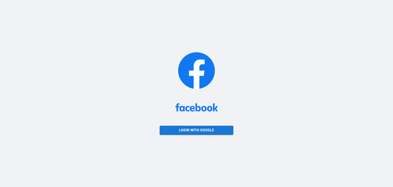
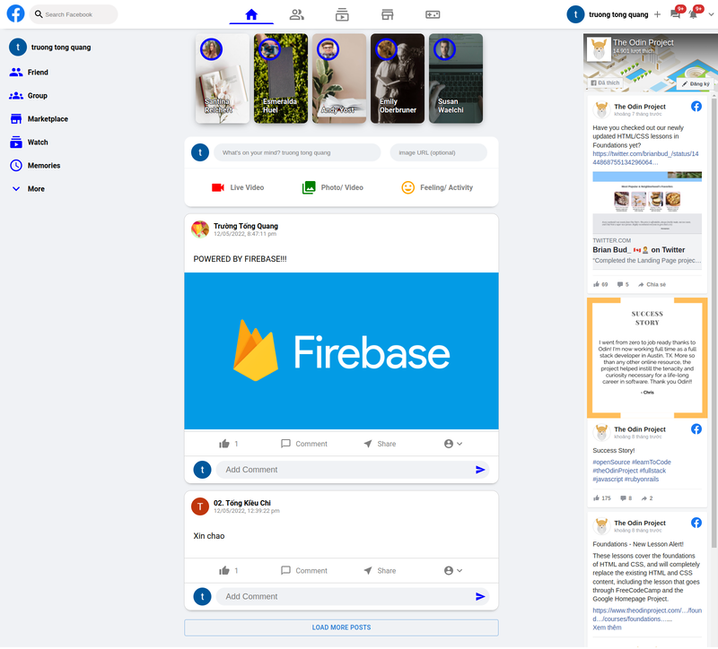

# Facebook Clone:

## LIVE Demo: https://facebook-clone-38694.web.app/



##



## Features

- Authentication with google.
- Add Post.
- Like and Unlike post.
- Add comment to post.
- Have realtime database with firebase.
- Global state (user) with Justand.
- Responsive.

## Build With:

- React.
- Firebase.
- Mui.
- Css.
- Zustand.
- Facebook page plugin: https://developers.facebook.com/docs/plugins/page-plugin/ .
- Webpack.

## Run Locally

Clone the project

```bash
  git clone git@github.com:truongwerk/fb-clone.git .
```

Install dependencies

```bash
  npm install
```

Start the server

```bash
  npm start
```

## License

[MIT](https://choosealicense.com/licenses/mit/)
